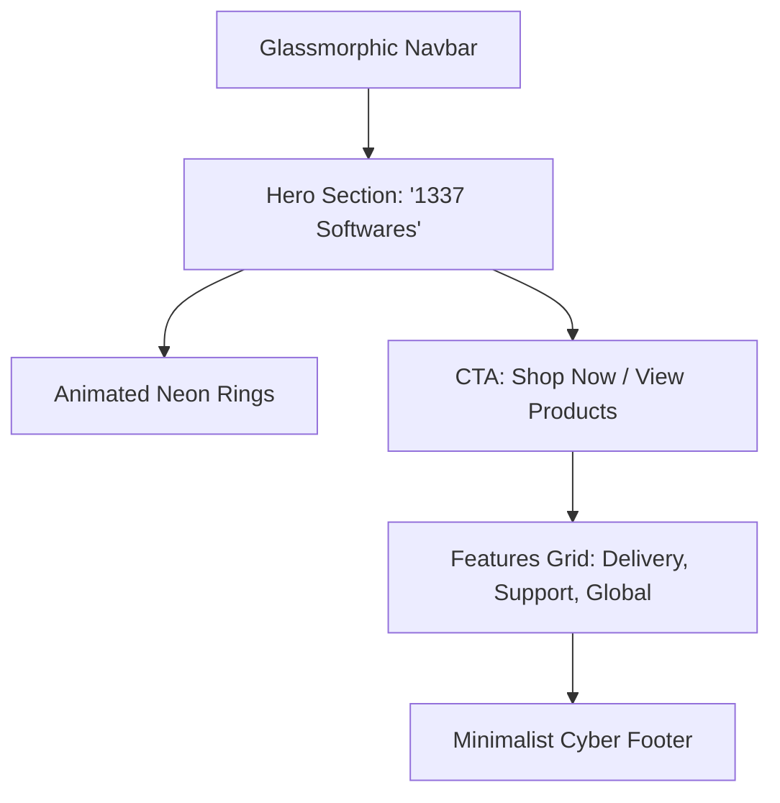
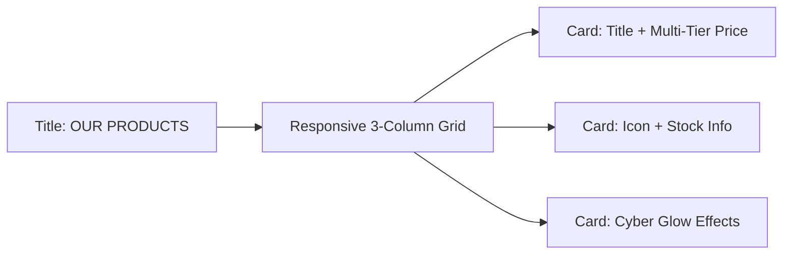

# 1337 Softwares - E-Commerce Platform Showcase

## 🚀 Overview

**1337 Softwares** is a premium, high-performance e-commerce platform designed for modern digital commerce. Built with a modern tech stack and a stunning **Cyberpunk-inspired UI**, it offers a seamless experience for both customers and administrators.

🔗 **Live Demo:** [1337-softwares.up.railway.app](https://1337-softwares.up.railway.app/)

> **Note:** This repository is a **Project Showcase** containing descriptions and visual assets. The source code is private.

---

## ✨ Key Features

### 👤 User Experience
- **Futuristic UI/UX:** A dark-themed, glassmorphic design with neon red accents, interactive particles, and animated glow effects.
- **Discord OAuth Integration:** Secure and fast login using Discord accounts.
- **Seamless Checkout:** Integrated shopping cart system with real-time stock limits.
- **Support System:** Dedicated support gateway for customer inquiries.

### 🛡️ Secure Platform
- **Role-Based Access Control:** Secure routes for Users, Admins, and Developers.
- **Legal Compliance:** Integrated Legal Notice Modal with Terms of Service, Privacy, and Refund policies.
- **Automated Direct Messages:** (Backend Feature) Discord bot integration for instant delivery and customer notifications.

### ⚙️ Administrative Power
- **Advanced Dashboard:** Real-time product management (Add, Edit, Delete).
- **Multi-Image Support:** Products support multiple showcase images and dedicated list icons.
- **Developer Tools:** Internal dashboard for system monitoring and advanced configurations.

---

## 🛠️ Tech Stack

- **Frontend:** React.js, Vite, Tailwind CSS / Vanilla CSS, React Router.
- **Backend:** Node.js, Express.
- **Database:** Supabase (PostgreSQL).
- **Authentication:** Discord OAuth2, JSON Web Tokens (JWT).
- **Storage:** Multer for local/cloud file handling.

---

## 📸 Visual Layouts

Since this is a private source showcase, we visualize the platform's layout and architecture below.

### Home Page Layout


### Products Page Layout


### Admin Dashboard Layout
```mermaid
graph TD
    Title[Admin Dashboard] --> Actions[Top Bar: + Add Product]
    Actions --> Table[Glassmorphic Data Table]
    Table --> Rows[Rows: Image | Name | Price | Stock | Actions]
    Rows --> Modals[Modals: Edit / Delete Confirmation]
```

---

## 📢 Contact & Support

For business inquiries or platform demonstrations, please reach out via our official channels.

---
*Created by [zakaria0dev](https://github.com/zakaria0dev)*
